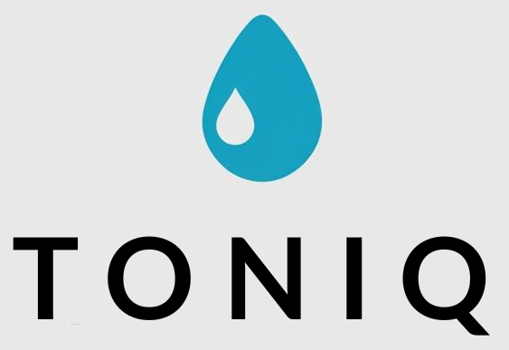
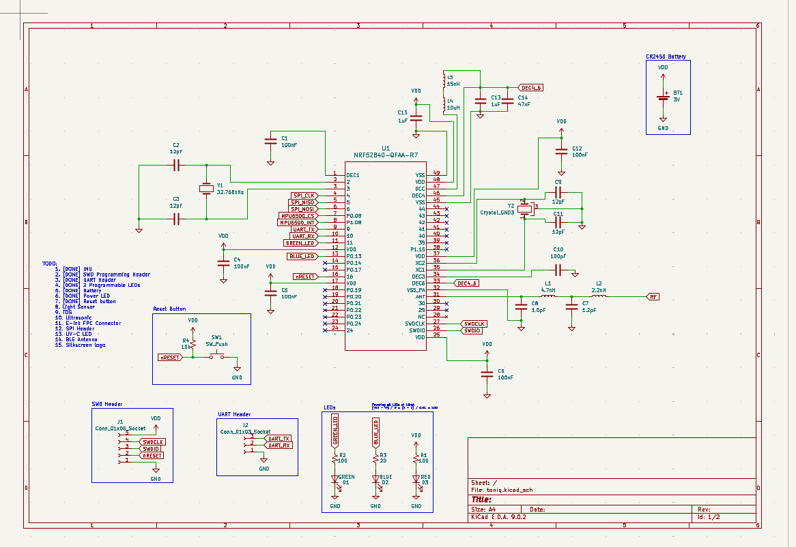
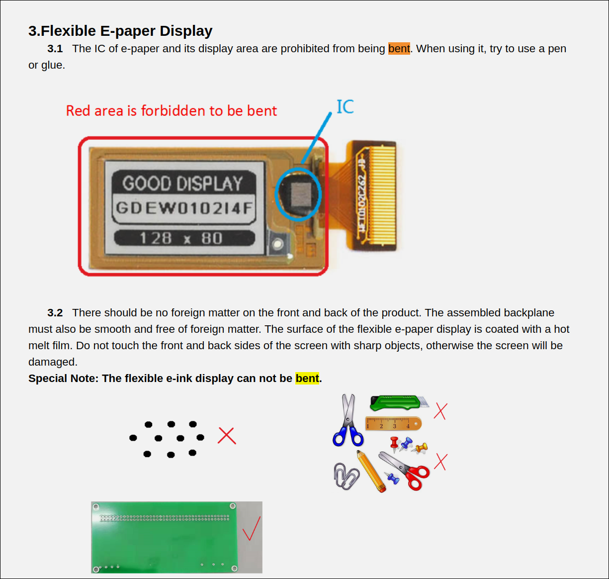
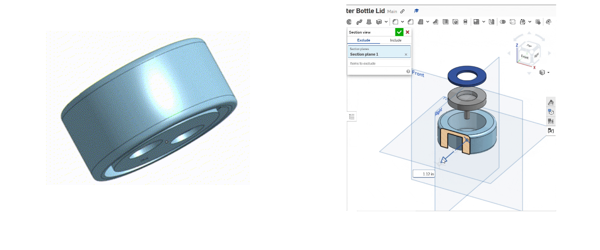
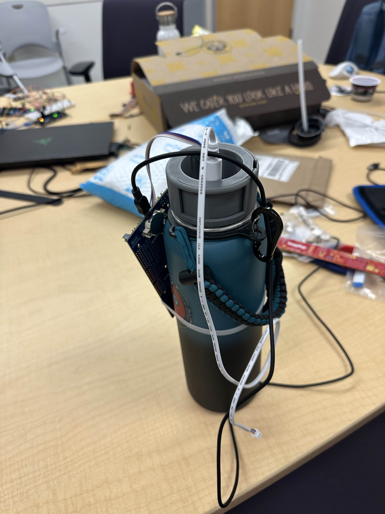
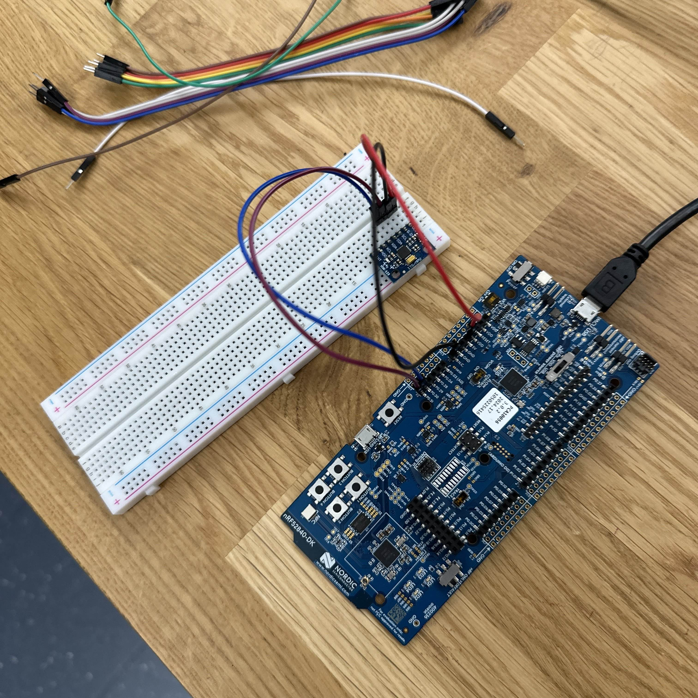
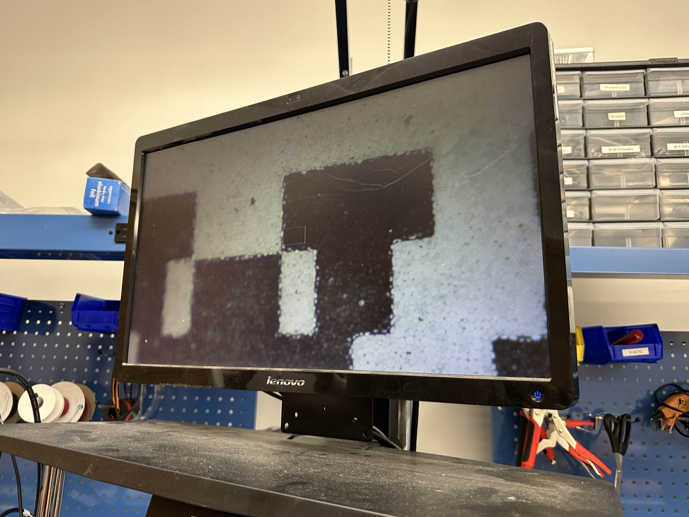
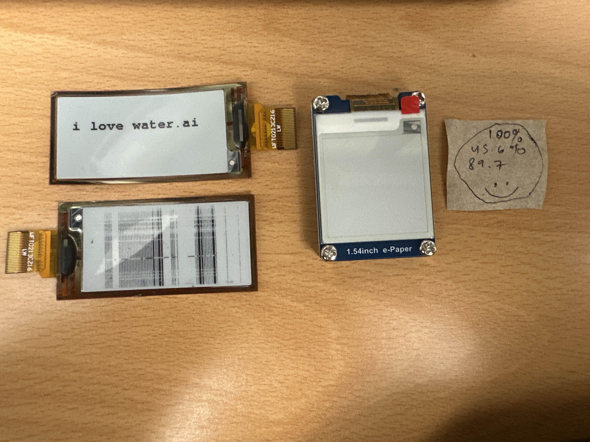

# TONIQ Smart Water Bottle
<p align="center">
  
</p>

[](https://github.com/your-username/toniq/actions)
[](https://opensource.org/licenses/MIT)
[](https://www.zephyrproject.org/)

## Table of Contents
1.  [Overview](#overview)
2.  [Features](#features)
3.  [Demo](#demo)
4.  [Team Members](#team-members)
5.  [Project Structure](#project-structure)
6.  [Hardware and Software](#hardware-and-software)
    * [Hardware Components](#hardware-components)
    * [Software Stack & Tools](#software-stack--tools)
7.  [Getting Started](#getting-started)
    * [Prerequisites](#prerequisites)
    * [Installation](#installation)
    * [Building and Flashing](#building-and-flashing)
8.  [Documentation](#documentation)
9.  [Milestones](#milestones)
10. [Gallery](#gallery)
11. [Contributing](#contributing)
12. [License](#license)
13. [Acknowledgments](#acknowledgments)

---

## Overview
TONIQ is a smart water bottle designed to improve the well-being of its users by tracking critical health metrics such as water consumption and water quality. These metrics are conveniently presented on an integrated e-ink display. The bottle also features an automated UV-C sterilization system to kill harmful viruses or bacteria that may be present in the liquid.

A key design feature is the lid, which contains all the electronics and is fully independent of the bottle itself. It is engineered to fit the exact specifications of a standard wide-mouth water bottle opening, enabling easy attachment to various water bottle bodies, such as a 32 oz. Hydro Flask.

The project aims to address common flaws found in existing smart water bottles, including high cost, inflexibility, reliance on a mobile app for tracking, and the need for nonstandard charging cables. TONIQ seeks to solve these key issues while maintaining an elegant and user-friendly design in one cohesive container.

---

## Features
* **Water Consumption Tracking:** Utilizes an ultrasonic sensor to monitor water levels over time.
* **Water Quality Measurement:** Employs a TDS (Total Dissolved Solids) sensor to assess water purity.
* **UV-C Sterilization:** Integrated UV-C LED for automated water sterilization, ensuring the liquid is free from harmful microorganisms. Safety mitigations ensure the LED only activates when the lid is closed.
* **E-Ink Display:** A power-efficient e-ink display presents health metrics and bottle status directly on the lid.
* **Universal Lid Design:** The smart lid is compatible with standard wide-mouth water bottles.
* **Power Efficiency:** Designed for long battery life using a replaceable CR2450 coin cell battery and a low-power MCU (Nordic nRF52840) with sleep states.
* **On-Device Interface:** All primary interactions and data display occur on the bottle itself, reducing reliance on a companion mobile app.
* **Motion Detection:** An IMU (gyroscope) determines if the bottle is upright or in motion (e.g., in a backpack) for contextual operations.

---

## Demo
A final demonstration video showcasing the TONIQ smart water bottle's features and functionality will be available here:
* [Link to Final Project Video](./assets/videos/final_demo_video.mp4) (Placeholder)

---

## Team Members
The TONIQ project was developed by a team of students from UC San Diego, CSE 237D Spring 2025:
* Cody Rupp
* Samir Rashid
* Kyle Trinh
* Anthony Tarbinian


---

## Project Structure
The repository is organized as follows:

```
TONIQ/
├── README.md
├── assets/
│   ├── images/                 <- Contains project photos, diagrams, and logos (e.g., TONIQ-logo.png, gallery images).
│   └── videos/                 <- Contains demonstration videos (e.g., final_demo_video.mp4).
├── docs/                       <- Contains all project documentation.
│   ├── Mid_Quarter_Report.pdf
│   └── Project_Specification.pdf
├── src/
│   ├── bluetooth.c             <- Bluetooth Low Energy functionality (initially planned, later abandoned for course scope). 
│   ├── eink.c                  <- E-Ink display driver and interface logic. 
│   ├── GxEPD2_154_D67.cpp      <- E-Ink display (GDEH0154D67 model) specific library code. 
│   ├── GxEPD2_154_D67.h
│   ├── main.c                  <- Main application logic. 
│   ├── tds.c                   <- TDS sensor interface code. 
│   ├── ultrasonic.c            <- Ultrasonic sensor interface code.
│   ├── include/                <- Header files for the project.
│   │   ├── bluetooth.h
│   │   ├── eink.h
│   │   ├── tds.h
│   │   └── ultrasonic.h
│   └── eink/                   <- Subdirectory for e-ink library files like GxEPD2_BW.h, Fonts.
├── .gitignore
├── CMakeLists.txt
├── default.overlay. 
├── Justfile
└── prj.conf
```

---

## Hardware and Software

### Hardware Components
* **Microcontroller (MCU):** Nordic nRF52840
* **Display:** 1.54" E-Ink Display (GDEH0154D67, 200x200 pixels)
* **Sensors:**
    * Ultrasonic Sensor: For water level measurement.
    * TDS (Total Dissolved Solids) Sensor: For water quality assessment.
    * IMU (Inertial Measurement Unit): Gyroscope for orientation detection.
* **Sterilization:** UV-C LED
* **Power:** CR2450 Coin Cell Battery (~620 mAh)
* **Mechanical:**
    * Custom 3D Printed Lid (designed to be food-safe, compatible with wide-mouth bottles e.g., Hydro Flask)
    * Lid Gasket
    * Vacuum Sealed Bottle Body (for demonstration)
* **Printed Circuit Board (PCB):** Custom designed PCB to house all electronic components.

**Bill of Materials (Approximate):**
| Item                 | Cost  |
|----------------------|-------|
| E-ink display        | $20   |
| E-ink driver board   | incl. |
| Lid polypropylene    | $0.1  |
| Lid gasket           | $0.1  |
| Coin cell battery    | $1    |
| PCB                  | $5    |
| Ultrasonic sensor    | $5    |
| UV-C LED             | $2    |
| Vacuum sealed bottle | $2    |
| **SUM** | **$35.2**|

### Software Stack & Tools
* **Operating System:** Zephyr RTOS
* **Programming Languages:** C, C++
* **Build System:** West (Zephyr's meta-tool), CMake
* **Hardware Abstraction:** Zephyr Device Drivers, Devicetree
* **CAD Software:** OnShape (for 3D modeling the lid)
* **Version Control:** Git, GitHub
* **Debugging/Programming:** JLink Programmer/Debugger
* **Development Board (Initial Prototyping):** nRF52840 DK (Development Kit)
* **Auxiliary Tools:** Logic Analyzer (for signal debugging)

---

## Getting Started

### Prerequisites
* A compatible host OS (Linux, macOS, Windows with WSL2). Arch Linux is used by the developers.
* Zephyr RTOS development environment setup. Follow the official [Zephyr Getting Started Guide](https://docs.zephyrproject.org/latest/develop/getting_started/index.html).
* `just` command-line tool installed.
* ARM GCC toolchain.
* West (Zephyr's meta-tool) installed.
* JLink GDB Server and associated tools (if using JLink for flashing/debugging).
* Hardware:
    * nRF52840DK or the custom TONIQ PCB with an nRF52840.
    * JLink programmer/debugger.

### Installation
1.  **Clone the repository:**
    ```bash
    git clone [https://github.com/your-username/toniq.git](https://github.com/your-username/toniq.git)
    cd toniq
    ```
2.  **Initialize West:**
    If you cloned into an existing Zephyr workspace:
    ```bash
    west update
    ```
    If it's a new standalone project:
    ```bash
    west init -l .
    west update
    ```
   

### Building and Flashing
The `Justfile` provides convenient commands for building and flashing.

1.  **Build the firmware:**
    This command cleans the build directory and builds for the `nrf52840dk/nrf52840` board.
    ```bash
    just build
    ```
    Alternatively, using West directly:
    ```bash
    west build --pristine -b nrf52840dk/nrf52840 src/
    ```
   

2.  **Flash the firmware:**
    This command uses `west flash` with the JLink runner. Ensure your JLink is connected to the target board.
    ```bash
    just flash
    ```
    Alternatively, using West directly:
    ```bash
    west flash --runner jlink
    ```
   

---

## Documentation
All relevant project documentation, including reports and presentations, can be found in the `/docs` directory of this repository.
* **Mid Quarter Report:** [`./docs/Mid_Quarter_Report.pdf`](./docs/Mid_Quarter_Report.pdf) - Details progress, challenges, and learnings as of the middle of the project.
* **Project Specification:** [`./docs/Project_Specification.pdf`](./docs/Project_Specification.pdf) - Outlines the initial project goals, scope, design, and management plan.
* **Final Report:** [`./docs/Final_Report.pdf`](./docs/Final_Report.pdf) (Placeholder) - Comprehensive summary of the project, final design, outcomes, and future work.
* **Source Code Comments:** The firmware source code is commented to explain logic and functionality.
* **CAD Files:** Mechanical design files (e.g., in OnShape) have labeled variables and transformations for clarity.

---
## Gallery
A collection of images showcasing the TONIQ project's development process and prototypes.








---

## Contributing
Currently, this project is primarily a university coursework submission. However, suggestions and contributions are welcome. Please feel free to open an issue to discuss potential changes or report bugs.

---

## License
This project is licensed under the MIT License. See the [LICENSE](LICENSE) file for details
